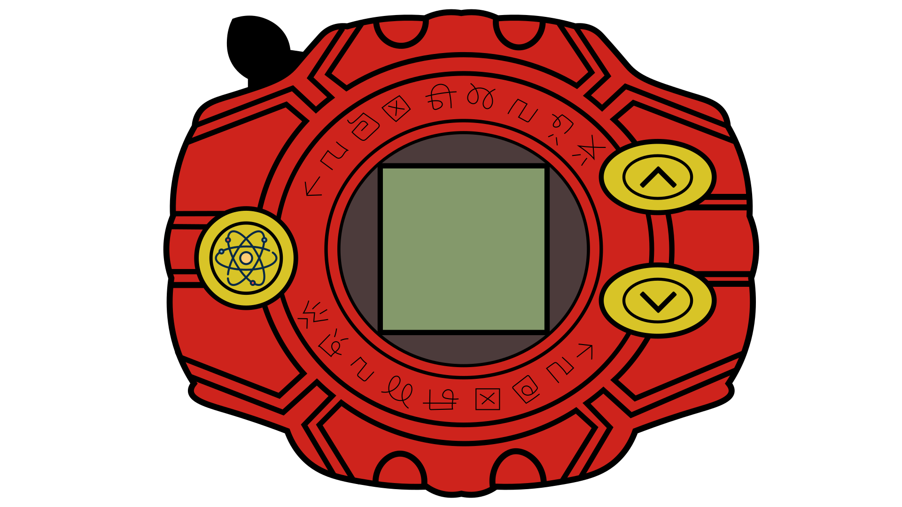

# duque_neira_hw3

## Digivice 

With the Digidevice, look for your favourite Digimon and know its information and evolution.

## Description

The Digidevice is a Vue and Ajax project. We use an existing API to get Digimon names and levels. Then, using our own API, we retrieve the evolution and images of each Digimon.

## Features

- **Digimon Selection**: Users can choose their favourite Digimon and learn about it.
  
- **Evolution**: Users can evolve their Digimon from the Digidevice.

## Implementation

- **Vue**: Vue.js is used for the frontend development.
  
- **Ajax**: Ajax is used to make asynchronous HTTP requests to fetch data from APIs.

## Installation

No installation is required. Download the files to your desktop.

## Usage

Open `index.html` in your preferred web browser.

1. **Step 1: Use the buttons on the right to move before or next**: 

2. **Step 2: Choose your Favorite Digimon**: 

3. **Step 3: EVOLVE IT!!**: 

## Contributing

1. Fork it!
2. Create your feature branch: `git checkout -b my-new-feature`
3. Commit your changes: `git commit -am 'Add some feature'`
4. Push to the branch: `git push origin my-new-feature`
5. Submit a pull request :D

## History

> We wanted a Minecraft API but there wasn't one so Dev Mich remembered that she liked to watch Digimon and we used the Digomons to make our project.

## Credits

Michelle Duque (Michelle)  
Sandra Paola Neira (San) 

## License

MIT License - See included license file
